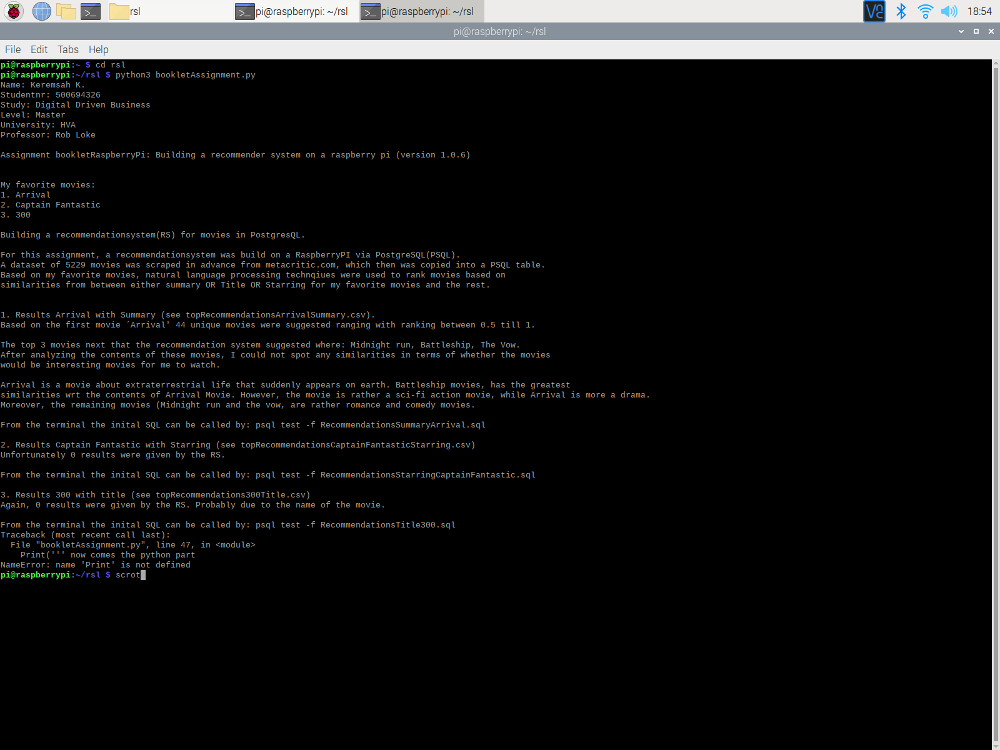
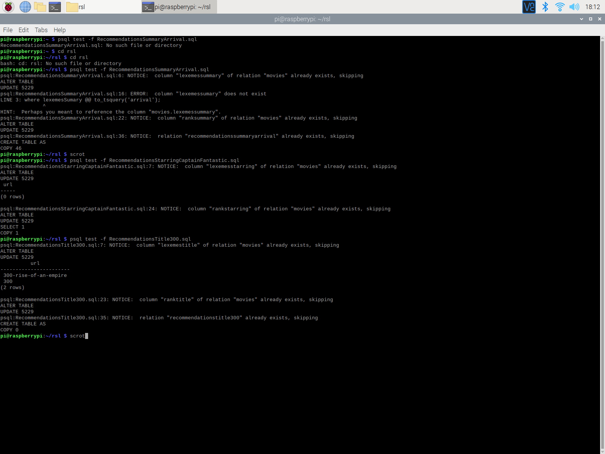
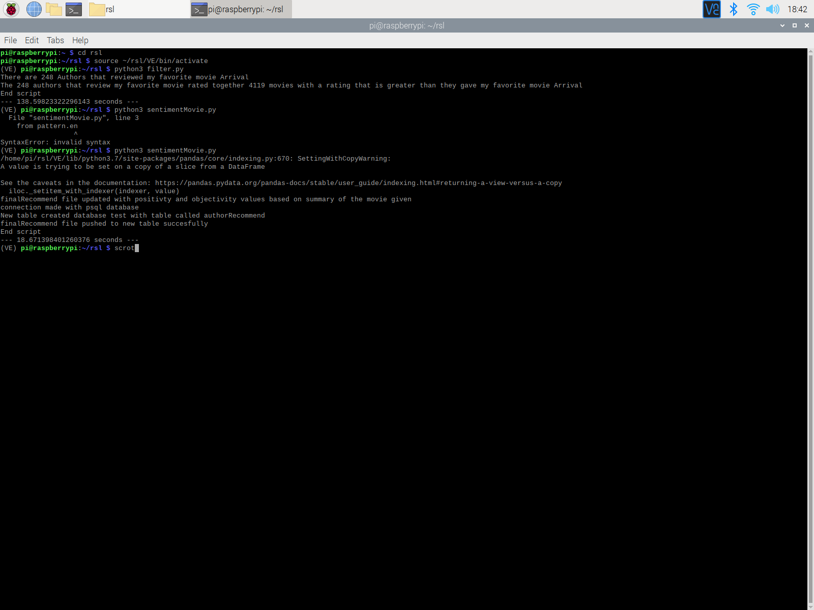

readme

run the bookletAssignment file type: python3 bookletAssignment.py in your terminal to get an explanation of the assignment.

Assignment description output (see below for SQL and Python script outputs)

results SQL scripts

results Python scripts

